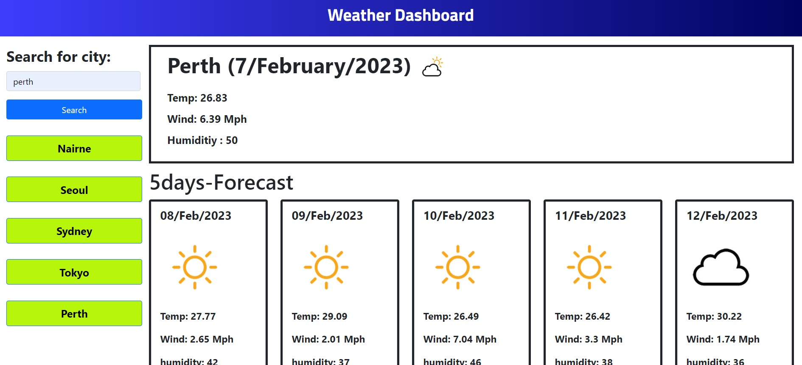

# JavaScript--Weather-Dashboard-serversideAPI

## Description

This project was created to create an application for Weather Dashboard. It contains notes on HTML, CSS and JavaScript.

I create a Weather Dashboard application with Server-Side APIs that meets certain criteria.

This app runs in the browser, and features dynamically updated HTML and CSS powered by JavaScript code.

I learned how to fetch Server-Side APIs, saving the data in local storage and using the data for code to make the application works dynamically.
 

## Installation

N/A  

## Usage

To understand the code that I code, please read the comments in JavaScript file.

When user search for a city, The user will be presented with current and future conditions for that city and that city is added to the search history

The user will be presented with the city name, the date, an icon representation of weather conditions, the temperature, the humidity, and the the wind speed for current weather conditions for that city.

Also the user will be presented with the city name, the date, an icon representation of weather conditions, the temperature, the humidity, and the the wind speed for future 5days weather conditions for that city.

If the user clicks button on a city in the search history, the user will be presented with current and future conditions for that city
 

URL = https://kayden-hyunsikkim.github.io/JavaScript-Weather-Dashboard-serversideAPI/  

(screenshot image could be slitely different with the web application)

## Credits

N/A

## License

N/A